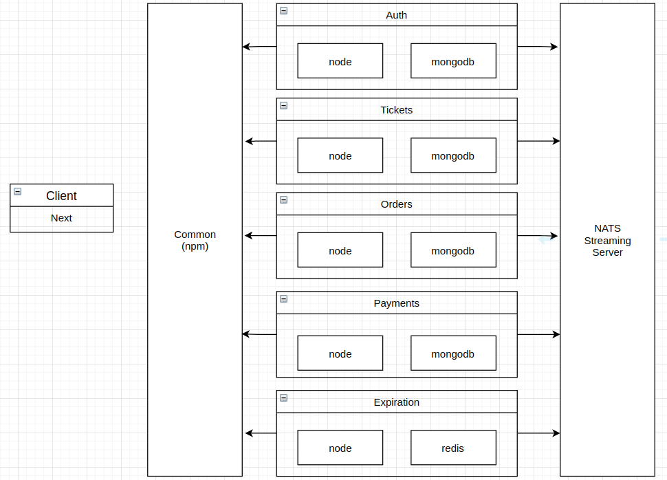

# Ticketing
An application for sell tickets.

## Table of contents
* [About](#about)
* [Inspiration](#inspiration)
* [Features](#features)
* [Technologies](#technologies)
* [Architecture](#architecture)
* [Startup](#startup)
* [Tests](#tests)
* [Deploy Digital Ocean](#deploy-digital-ocean)
* [Status](#status)
* [Contact](#contact)

## About
The intention of doing this project was to understand how to develop a fullstack application based on microsevices architecture using React, Nuxt, Node, Typescript and Kubernets.

## Inspiration
The knowledge was acquired in Stephen Grider's Microservices with Node JS and React Course. The objective of the course was to develop and deploy fullstack microservice applications following best practices using React, Next, Node.js, TypeScript and Kubernets.

Thank you a lot Stephen!!!

## Features
List of features ready and TODOs for future development
* Signup
* Signin
* Signout
* Create ticket
* Update ticket
* Search tickets
* Create order
* Update order
* Search orders
* Create payments using stripe
* Order expiration controll

To-do list:
* Improve frontend web application layout and usability.
* Document API
* Apply MVC pattern

## Technologies
* React - https://reactjs.org/
* Next - https://nextjs.org/
* Node - https://nodejs.org/en/
* Typescript - https://www.typescriptlang.org/
* Jest - https://jestjs.io/
* MongoDB - https://www.mongodb.com/
* Redis - https://redis.io/
* Kubernetes - https://kubernetes.io/
* Skaffold - https://skaffold.dev/

## Architecture


## Startup

### Minikube Setup on Linux

These instructions should be valid for Debian / Ubuntu / Mint Linux distributions. Your experience may vary if using an RHEL / Arch / Other distribution or non desktop distro like Ubuntu server, or lightweight distros which may omit many expected tools.

### Install VirtualBox:

Find your Linux distribution and download the .deb package, using a graphical installer here should be sufficient. If you use a package manager like apt to install from your terminal, you will likely get a fairly out of date version.

https://www.virtualbox.org/wiki/Linux_Downloads

After installing, check your installation to make sure it worked:

```sh
$ VBoxManage —version
```

As an alternative you can use (or maybe you have to use) KVM instead of VirtualBox. Here are some great instructions that can be found in this post (Thanks to Nick L. for sharing):

https://computingforgeeks.com/install-kvm-centos-rhel-ubuntu-debian-sles-arch/


### Install Kubectl

In your terminal run the following:

```sh
$ curl -LO https://storage.googleapis.com/kubernetes-release/release/$(curl -s https://storage.googleapis.com/kubernetes-release/release/stable.txt)/bin/linux/amd64/kubectl
```

```sh
$ chmod +x ./kubectl
```

```sh
$ sudo mv ./kubectl /usr/local/bin/kubectl
```

Check your Installation:
```sh
$ kubectl version
```

See also official docs:
https://kubernetes.io/docs/tasks/tools/install-kubectl/#install-kubectl-on-linux


### Install Minikube

In your terminal run the following:
```sh
$ curl -Lo minikube https://storage.googleapis.com/minikube/releases/latest/minikube-linux-amd64 && chmod +x minikube
```
```sh
$ sudo install minikube /usr/local/bin
```

Check your installation:
```sh
$ minikube version
```

Start Minikube:
```sh
minikube start
```

See also official docs:

https://kubernetes.io/docs/tasks/tools/install-minikube/

#### Create secrets
The secrets are used in the payment service. Look in to payments-deploy.yml file.
- jwt-secret
```sh
kubectl create secret generic jwt-secret --from-literal=JWT_KEY=<your jwt secret>
```
- stripe-secret
```sh
kubectl create secret generic stripe-secret --from-literal=STRIPE_KEY=<your stripe secret>
```
PS:. You must create a stripe account -> www.stripe.com. After that you can create you stripe secret in Developers/API Keys in the menubar.

## Tests
#### To run test
Every project has a npm test script that could be started using the command inside the container:
```sh
npm run test
```

## Deploy Digital Ocean

### Install doctl 
doctl can be installed via snap on ubuntu. See also official docs: https://github.com/digitalocean/doctl

### Connect to Digital Ocean
#### Generate a connection token.
1. Go to API in the sidebar menu
2. Click the Generate new Token button
3. Set the token name
4. Click the Generate Token button

#### Authenticate
1. Go to terminal end run the command:
```sh
doctl auth init
```
2. Enter the token from the previus step

#### Set cluster to kubectl
1. If using snap,  grant access to the doctl:kube-config plug to use this command with: 
```sh
sudo snap connect doctl:kube-config
```
2. Run the command: 
```sh
doctl kubernetes cluster kubeconfig save <name of your cluster> 
```
#### Create secrets
The secrets are used in the payment service. Look in to payments-deploy.yml file.
- jwt-secret
```sh
kubectl create secret generic jwt-secret --from-literal=JWT_KEY=<your jwt secret>
```
- stripe-secret
```sh
kubectl create secret generic stripe-secret --from-literal=STRIPE_KEY=<your stripe secret>
```
PS:. You must create a stripe account -> www.stripe.com. After that you can create you stripe secret in Developers/API Keys in the menubar.

#### Setup Ingress

- Add helm repository 
```sh
helm repo add stable https://kubernetes-charts.storage.googleapis.com/
```

- Install ingress controller
```sh
 helm install nginx-ingress stable/nginx-ingress --set controller.publishService.enabled=true
 ```
 
 - Apply k8s-prod ingress file
```sh
kubectl apply infra/k8s-prod
```
## Status
Project is: _finished_

## Contact
Created by tiagovalentim@gmail.com - feel free to contact me!
